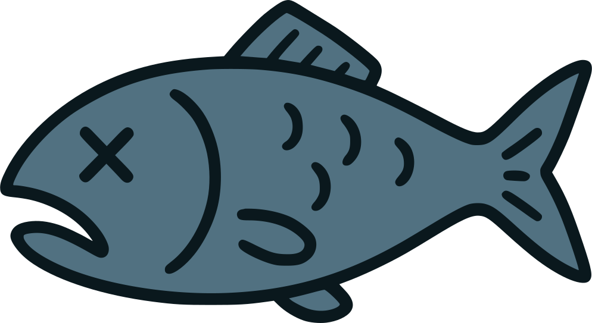
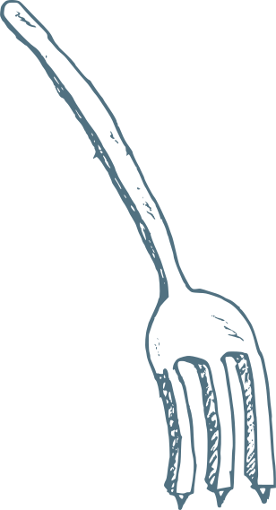

<pre align="center"><code align="center">The public face of a dead fish.</code></pre>

<pre align="center"><code align="center">x I would swim if I wasn't dead x
&lt;DeDxHERRiNG&gt;</code></pre>

# Forked Poole

This is a [fork](andrewhwanpark/dark-poole) of a [fork](https://github.com/mdo/poole) of a [fork](https://github.com/poole/poole).

## Original Author

**Mark Otto**

- <https://github.com/mdo>
- <https://twitter.com/mdo>

## License

Open sourced under the [MIT license](LICENSE.md).

<3
